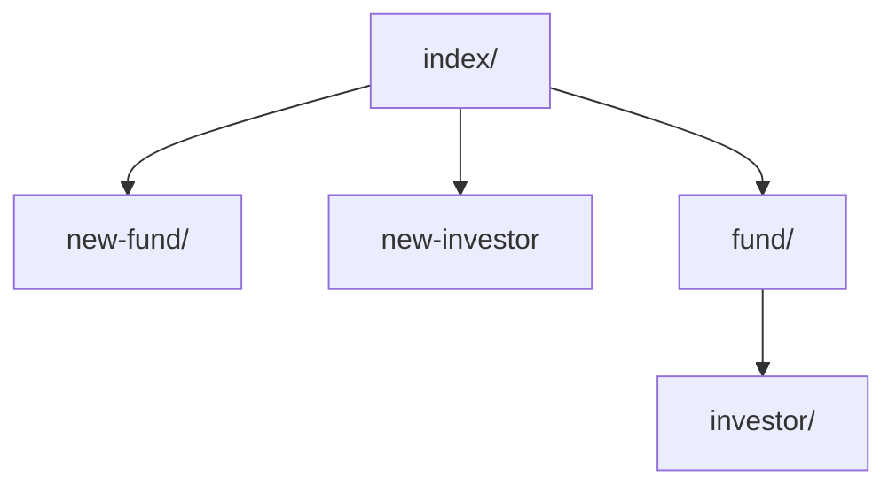

# Fundsite
En hjemmeside lavet i Django efter de givne speficikationer.

## Struktur
Landingssiden er på localhost:8000/funds/. Derfra linkes der til siderne new-fund/ og new-investor hvor der som navnet antyder kan oprettes fonde og brugere der vil blive tilføjet til databasen. Der linkes også til alle fonde i databasen, og fra deres side til de investorer der er registreret på dem.

index/ fungerer som hovedside PT. Root url 404'er.

## Models
Siden benytter to models, Fund og Investor, der udvides via ModelForms FundForm() og InvestorForm().

Fund to to elementer, "name" og "description". Investor har "first_name", "last_name", "creation_date" og "fund".

Investor objekter linker til Fund objekter many-to-one.

## Style
Siden benytter stylesheetet <link rel="stylesheet" href="https://cdn.jsdelivr.net/npm/water.css@2/out/water.css">.

Kunne godt være pænere, men hvad kan man gøre  ¯\\\_(ツ)\_/¯

## Mulige forbedringer
 - Siden nulstiller ikke forms, så hvis man refresher med formed udfyldt bliver objektet oprettet i databasen.
 - Man kan kun navigere via links da der bruges database-id i url'en.
 - Vildt sårbar over for SQL-injections.
 - Kunne se bedre ud :grimacing:
